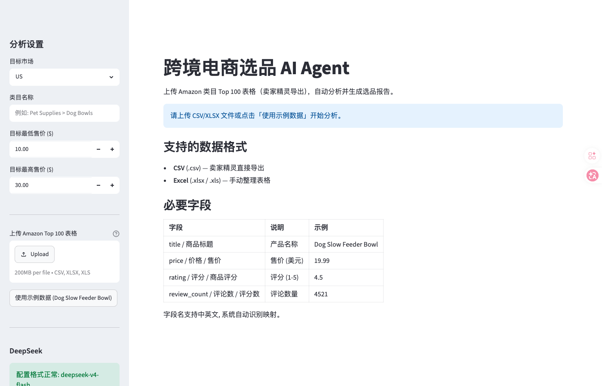
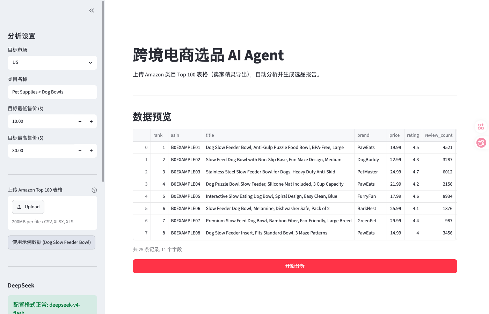
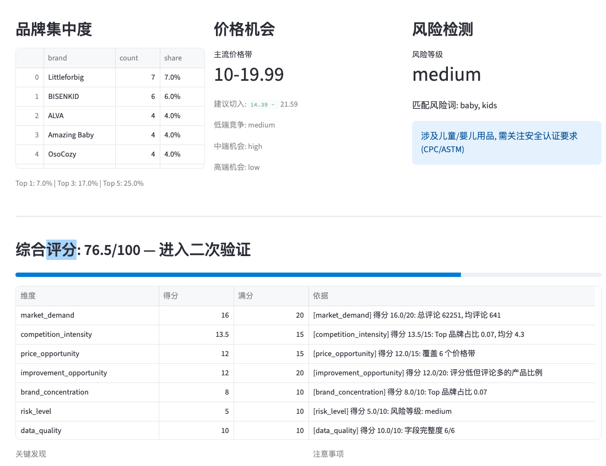
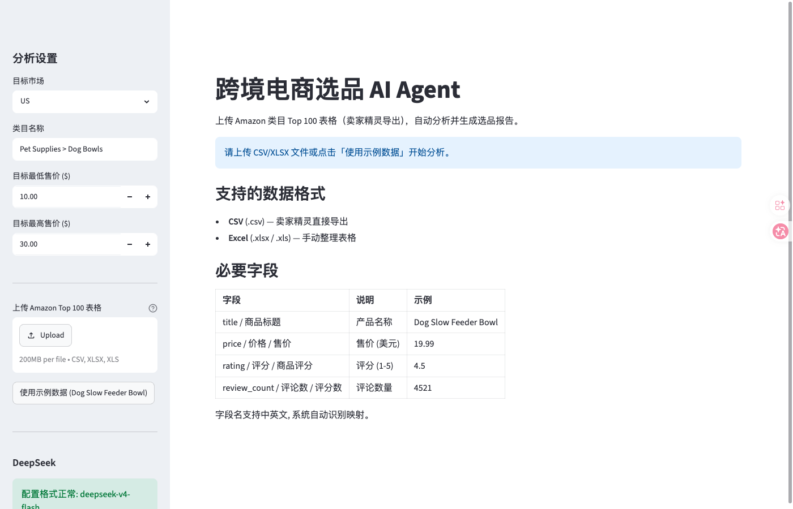
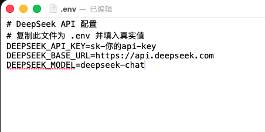

# 跨境电商选品 AI Agent

[](https://www.python.org/)
[](https://docs.astral.sh/uv/)
[](./tests)
[](./LICENSE)

> 基于 Amazon 类目 Top 100 数据的智能选品分析工具。上传卖家精灵导出的表格，自动完成数据清洗、指标计算、规则评分，并生成结构化选品报告。
>
> **核心设计**：数值计算由代码完成，语义分析交给 AI —— 规则引擎与 DeepSeek 深度融合。

<!-- 图片位置 1：项目封面/主界面截图 -->
<!-- 建议图片：Streamlit 主界面，展示侧边栏配置 + 数据预览区域，尺寸 1200×700 左右 -->


---

## 目录

- [项目简介](#项目简介)
- [快速开始](#快速开始)
- [核心能力](#核心能力)
- [配置 API Key](#配置-api-key)
- [如何部署](#如何部署)
- [常见问题](#常见问题)
- [项目限制与规划](#项目限制与规划)
- [相关文档](#相关文档)

---

## 项目简介

跨境电商选品 AI Agent 面向 Amazon 卖家与产品经理，通过分析**卖家精灵插件导出的类目 Top 100 表格**，快速判断一个类目是否值得进入。

**数据处理流程：**

```
上传 CSV/XLSX → 字段映射 → 数据清洗 → 指标计算 → 风险检测 → 规则评分 → AI 报告 → 下载
```

**适合场景：**

- Amazon 类目市场调研与竞争格局判断
- 新产品开发机会评估
- 供应链选品初步筛选
- AI 产品经理（AI Agent 方向）面试案例分析

---

## 快速开始

### 1. 安装 uv（一次性）

**Windows（PowerShell）：**

```powershell
powershell -c "irm https://astral.sh/uv/install.ps1 | iex"
```

**Mac（终端）：**

```bash
curl -LsSf https://astral.sh/uv/install.sh | sh
```

安装后**重启终端**，验证：`uv --version`

### 2. 克隆并进入项目

```bash
git clone <你的仓库地址>
cd aiagent
```

### 3. 安装依赖

```bash
uv sync
```

### 4. 启动应用

**一键启动（推荐）：**

| 系统 | 操作 |
|------|------|
| Windows | 双击 `run.bat` |
| Mac | 双击 `run.sh` 或终端执行 `./run.sh` |

**手动启动：**

```bash
uv run streamlit run app.py
```

浏览器访问 `http://localhost:8501`

### 5. 3 分钟体验（无需 API Key）

1. 点击左侧 **「使用示例数据」**
2. 市场选择 `US`，类目填写 `Pet Supplies > Dog Bowls`
3. 点击 **「开始分析」**
4. 查看评分、图表与报告
5. 下载 `.md` 报告和清洗后的 `.csv`

<!-- 图片位置 2：一键启动/侧边栏配置截图 -->
<!-- 建议图片：展示「使用示例数据」按钮、市场选择、类目输入、开始分析按钮 -->


---

## 核心能力

### 数据处理能力

| 能力 | 说明 |
|------|------|
| 多格式支持 | CSV、XLSX、XLS |
| 智能字段映射 | 自动识别中英文、大小写变体字段名 |
| 数据清洗 | 价格/评分/评论数格式化、空标题过滤、去重 |
| 字段容错 | 缺失字段不崩溃，给出明确提示 |

### 分析能力

| 能力 | 说明 |
|------|------|
| 基础指标 | 产品数、平均/中位价格、平均评分、评论总数 |
| 价格带分布 | 0-9.99 / 10-19.99 / 20-29.99 / 30-49.99 / 50-99.99 / 100+ |
| 评论数分布 | 0-99 / 100-499 / 500-999 / 1000-4999 / 5000-9999 / 10000+ |
| 品牌集中度 | Top 1/3/5 品牌占比分析 |
| 价格机会 | 主流价格带 + 建议切入区间（中位价 ± 20%） |
| 风险检测 | 40+ 中英文风险关键词，覆盖认证、侵权、安全、物流 |
| 产品机会 | 自动筛选「评论多 + 评分低」的改良候选 |

### 评分模型

7 维度 100 分制，权重可通过 `config/scoring_rules.yaml` 调整：

| 维度 | 权重 | 核心依据 |
|------|------|---------|
| 市场需求 | 20 | 评论总量 |
| 改良机会 | 20 | 低评分高评论产品占比 |
| 竞争强度 | 15 | 品牌分散与评分成熟度 |
| 价格机会 | 15 | 价格带分布分散度 |
| 品牌集中度 | 10 | Top 品牌占比 |
| 风险等级 | 10 | 风险关键词命中情况 |
| 数据质量 | 10 | 必要字段完整度 |

**评分等级：**

```
>= 80 分 → 优先开发
65-79 分 → 进入二次验证
50-64 分 → 谨慎观察
< 50 分  → 不建议开发
```

<!-- 图片位置 3：评分结果/仪表盘截图 -->
<!-- 建议图片：展示综合评分卡片、7 维度雷达图/条形图、等级建议 -->


### AI 报告

- 接入 DeepSeek API（OpenAI 兼容接口）
- 传入全部 100 行原始数据，不做截断
- 生成 12 章节 Markdown 结构化报告：
  1. 基础信息
  2. 类目概况
  3. 市场需求
  4. 竞争强度
  5. 价格带分析
  6. 品牌集中度
  7. 产品机会
  8. 差异化方向
  9. 风险提示
  10. 综合评分
  11. 开发建议
  12. 验证清单

**无 API Key 自动回退到本地 Jinja2 模板报告**，基础功能不受影响。

<!-- 图片位置 4：AI 报告示例截图 -->
<!-- 建议图片：展示生成的 Markdown 报告内容，或报告下载区域 -->


---

## 配置 API Key

### 获取 DeepSeek API Key

1. 访问 [DeepSeek 开放平台](https://platform.deepseek.com/)
2. 注册/登录账号
3. 进入「API Keys」创建新 Key
4. 复制 Key（格式通常为 `sk-...`）

### 配置到项目

```bash
cp .env.example .env
```

编辑 `.env` 文件：

```env
DEEPSEEK_API_KEY=sk-你的api-key
DEEPSEEK_BASE_URL=https://api.deepseek.com
DEEPSEEK_MODEL=deepseek-chat
```

### 模型选择建议

| 模型 | 特点 | 适用场景 |
|------|------|---------|
| `deepseek-chat` | 通用能力强 | 默认推荐 |
| `deepseek-v4-flash` | 速度快、成本低 | 大量测试时 |
| `deepseek-reasoner` | 推理能力强 | 复杂类目深度分析 |

**注意：** `.env` 文件已加入 `.gitignore`，不会提交到仓库，请勿在代码中硬编码 API Key。

<!-- 图片位置 5：API Key 配置示意图 -->
<!-- 建议图片：展示 .env 文件内容与 DeepSeek 平台 API Keys 页面（可打码部分 Key） -->


---

## 如何部署

### 本地部署

按照 [快速开始](#快速开始) 步骤执行即可。项目依赖 `uv` 自动管理 Python 版本和虚拟环境，无需手动安装 Python 3.11。

### 服务器部署（Linux）

```bash
# 1. 安装 uv
curl -LsSf https://astral.sh/uv/install.sh | sh

# 2. 克隆项目
git clone <你的仓库地址>
cd aiagent

# 3. 安装依赖
uv sync

# 4. 配置 API Key（可选）
cp .env.example .env
# 编辑 .env 填入 DEEPSEEK_API_KEY

# 5. 启动（指定 host 和 port）
uv run streamlit run app.py --server.address 0.0.0.0 --server.port 8501
```

### Docker 部署（可选）

项目目前未内置 Dockerfile。如需容器化，可参考以下最小示例：

```dockerfile
FROM ghcr.io/astral-sh/uv:python3.11-bookworm

WORKDIR /app
COPY . .

RUN uv sync --frozen

EXPOSE 8501

CMD ["uv", "run", "streamlit", "run", "app.py", "--server.address=0.0.0.0"]
```

### 云部署建议

- **Streamlit Community Cloud**：直接上传 GitHub 仓库即可部署
- **Hugging Face Spaces**：选择 Streamlit SDK，上传代码
- **自有服务器**：使用 `systemd` 或 `supervisor` 托管 Streamlit 进程

<!-- 图片位置 6：部署架构/运行示意图 -->
<!-- 建议图片：展示浏览器访问 localhost:8501 的界面，或服务器部署流程图 -->


---

## 常见问题

### Q1: 上传表格后提示字段不识别？

系统已内置常见中文字段名映射。如果卖家精灵导出的字段名特殊，编辑 `config/field_aliases.yaml` 添加映射即可：

```yaml
price:
  - price
  - 价格
  - 售价
  - 你的自定义字段名
```

### Q2: 不配置 API Key 能用吗？

可以。不配置 Key 时，系统会回退到本地 Jinja2 模板报告，所有数值计算、图表、评分功能均不受影响。

### Q3: AI 报告生成失败怎么办？

1. 检查 `.env` 中 `DEEPSEEK_API_KEY` 是否正确
2. 检查网络连接和 DeepSeek 账户余额
3. 系统会自动回退到本地模板报告，不会中断使用
4. 查看终端日志获取详细错误信息

### Q4: 评分为什么偏低？

常见原因：

- 品牌集中度过高（Top 1 品牌占比大）
- 产品评分过于成熟（多数 > 4.5 星，改良空间小）
- 风险关键词命中较多
- 必要字段缺失较多

可在「综合评分」区域查看每个维度的具体得分和原因。

### Q5: 支持哪些市场？

界面支持：US、UK、DE、JP、CA。市场选择主要用于报告标注和文件命名，不影响评分算法。

### Q6: 历史记录保存在哪里？

保存在 `data/app.db`（SQLite），自动记录最近 10 次分析。DB 路径使用绝对路径，不受启动目录影响。

### Q7: 端口 8501 被占用？

Streamlit 会自动尝试其他端口，具体请看终端输出。也可手动指定：

```bash
uv run streamlit run app.py --server.port 8502
```

### Q8: 评分结果可以直接作为决策依据吗？

**不能。** 评分仅基于 Top 100 表格的统计特征，不包含差评内容分析、利润测算、供应链成本、平台政策变化等因素。所有结论必须经过人工验证。

---

## 项目限制与规划

### 当前版本（第一版）不做

| 功能 | 原因 |
|------|------|
| 自动爬虫 | 聚焦表格分析，爬虫留到第二版 |
| LangGraph | 当前流程简单，纯函数足够；面试时可作为第二版规划讨论 |
| FastAPI 后端 | Streamlit 已内置后端能力 |
| 利润测算 | 缺少成本数据，第二版结合供应链信息 |

### 已知局限

- 仅分析 Top 100 表格，不看具体差评内容
- 不做利润和供应链成本计算
- AI 结论为辅助参考，不能替代人工判断

---

## 相关文档

- [快速使用指南](./快速使用.md) — 5 分钟上手
- [详细使用说明](./详细使用说明.md) — 功能、评分模型、架构详解
- [设计文档](./docs/superpowers/specs/2026-06-22-ecom-product-agent-design.md) — 产品设计与技术决策
- [CLAUDE.md](./CLAUDE.md) — 项目开发规范

---

## 技术栈

| 层 | 技术 | 说明 |
|---|------|------|
| 包管理 | [uv](https://docs.astral.sh/uv/) | Rust 编写，跨平台一致 |
| 前端界面 | [Streamlit](https://streamlit.io/) | 零前端依赖 |
| 数据处理 | Pandas + openpyxl | CSV/XLSX 处理 |
| AI 接口 | DeepSeek API | OpenAI 兼容接口 |
| 配置管理 | YAML + `.env` | 规则可配、密钥安全 |
| 数据存储 | SQLite | 零配置历史记录 |
| 测试 | pytest | 39 个单元/集成测试 |

---

## 测试

```bash
uv run pytest          # 运行全部测试
uv run pytest -v       # 详细输出
uv run pytest tests/test_scoring.py -v  # 单模块测试
```

---

## 许可证

[MIT License](./LICENSE)

---

> **免责声明**：本工具生成的所有选品建议、评分和报告仅供参考，不构成任何投资或商业决策建议。用户应结合自身情况独立判断并承担相应责任。
