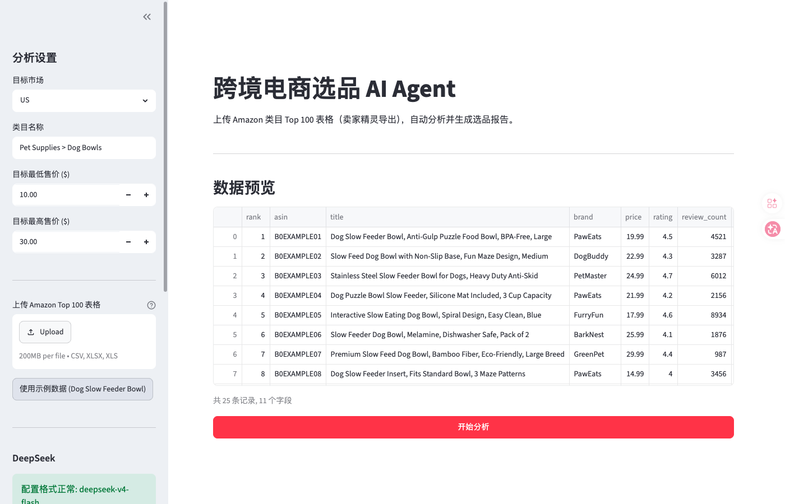
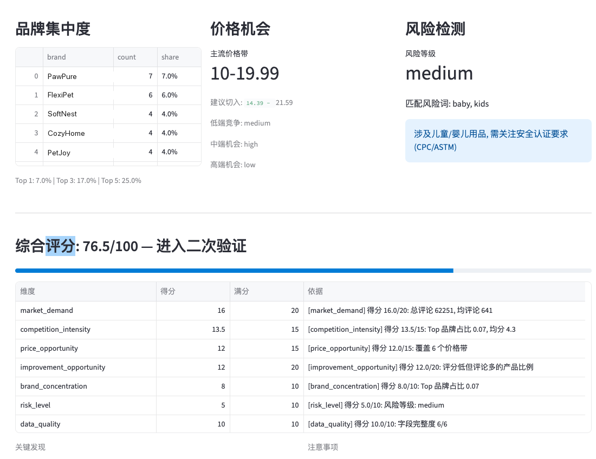
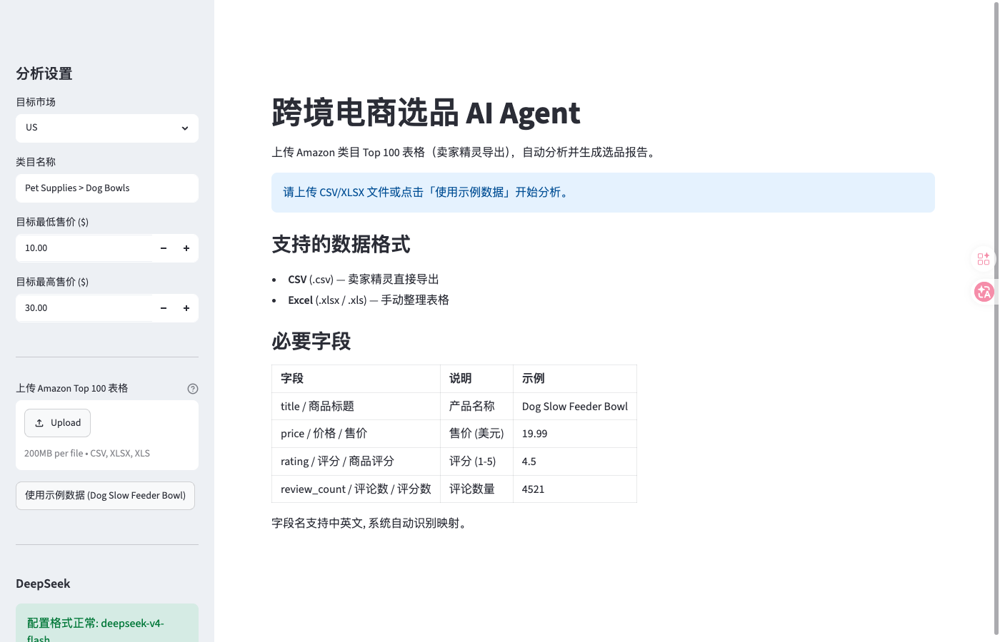
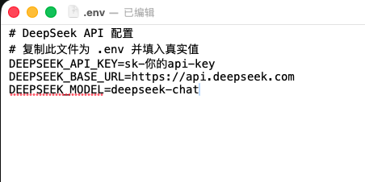

# Cross-border E-commerce Product Selection AI Agent

[](https://www.python.org/)
[](https://docs.astral.sh/uv/)
[](./tests)
[](./LICENSE)

> An intelligent product-selection tool built on Amazon category Top 100 data. Upload a spreadsheet exported from SellerSprite and it handles data cleaning, metric calculation, and rule-based scoring, then produces a structured selection report.
>
> **Core design**: numbers are computed by code, semantics are handled by AI — a rule engine deeply integrated with DeepSeek.

**中文版本 → [README.md](./README.md)**

---

## Contents

- [Overview](#overview)
- [Quick start](#quick-start)
- [Capabilities](#capabilities)
- [Configuring the API key](#configuring-the-api-key)
- [Deployment](#deployment)
- [FAQ](#faq)
- [Scope and roadmap](#scope-and-roadmap)
- [Further documentation](#further-documentation)
- [Tech stack](#tech-stack)
- [Testing](#testing)
- [License](#license)

---

## Overview

Built for Amazon sellers and product managers: take a **category Top 100 spreadsheet exported from the SellerSprite plugin** and decide quickly whether a category is worth entering.

**Processing pipeline:**

```
Upload CSV/XLSX → field mapping → data cleaning → metrics → risk detection → rule scoring → AI report → download
```

**Good fits:**

- Amazon category research and competitive-landscape assessment
- Evaluating new product development opportunities
- First-pass supply-chain product screening
- A case study for AI product manager (AI Agent) interviews

---

## Quick start

### 1. Install uv (once)

**Windows (PowerShell):**

```powershell
powershell -c "irm https://astral.sh/uv/install.ps1 | iex"
```

**macOS / Linux:**

```bash
curl -LsSf https://astral.sh/uv/install.sh | sh
```

**Restart your terminal** afterwards, then verify with `uv --version`.

### 2. Clone and enter the project

```bash
git clone <your repository URL>
cd aiagent
```

### 3. Install dependencies

```bash
uv sync
```

### 4. Launch

**One-click (recommended):**

| OS | Action |
|----|--------|
| Windows | Double-click `run.bat` |
| macOS / Linux | Double-click `run.sh`, or run `./run.sh` |

**Manually:**

```bash
uv run streamlit run app.py
```

Then open `http://localhost:8501`.

### 5. Three-minute tour (no API key needed)

1. Click **Use sample data** in the sidebar
2. Set Market to `US` and Category to `Pet Supplies > Dog Bowls`
3. Click **Start analysis**
4. Review the score, charts, and report
5. Download the `.md` report and the cleaned `.csv`



---

## Capabilities

### Data handling

| Capability | Description |
|------------|-------------|
| Multiple formats | CSV, XLSX, XLS |
| Smart field mapping | Recognises Chinese and English names plus case variants automatically |
| Data cleaning | Price / rating / review-count formatting, empty-title filtering, deduplication |
| Field tolerance | Missing fields do not crash the run; you get a clear message instead |

### Analysis

| Capability | Description |
|------------|-------------|
| Base metrics | Product count, mean/median price, average rating, total reviews |
| Price-band distribution | 0–9.99 / 10–19.99 / 20–29.99 / 30–49.99 / 50–99.99 / 100+ |
| Review-count distribution | 0–99 / 100–499 / 500–999 / 1000–4999 / 5000–9999 / 10000+ |
| Brand concentration | Share held by the Top 1 / 3 / 5 brands |
| Price opportunity | Dominant price band plus a suggested entry range (median ± 20%) |
| Risk detection | 44 risk keywords (24 English + 20 Chinese) covering certification, IP, safety, and logistics |
| Product opportunity | Surfaces "many reviews but low rating" candidates worth improving on |

### Scoring model

Seven dimensions, 100 points total. Weights are editable in `config/scoring_rules.yaml`:

| Dimension | Weight | Based on |
|-----------|--------|----------|
| Market demand | 20 | Total review volume |
| Improvement opportunity | 20 | Share of products with low ratings but many reviews |
| Competition intensity | 15 | Brand fragmentation and rating maturity |
| Price opportunity | 15 | Dispersion of the price-band distribution |
| Brand concentration | 10 | Share held by top brands |
| Risk level | 10 | Risk keyword hits |
| Data quality | 10 | Completeness of required fields |

**Score bands:**

```
>= 80  → Prioritise for development
65-79  → Move to second-round validation
50-64  → Observe with caution
< 50   → Not recommended
```



### AI report

- Connects to the DeepSeek API (OpenAI-compatible interface)
- Passes all 100 raw rows to the model — no truncation
- Generates a 12-section structured Markdown report:
  1. Basic information
  2. Category overview
  3. Market demand
  4. Competition intensity
  5. Price-band analysis
  6. Brand concentration
  7. Product opportunity
  8. Differentiation directions
  9. Risk warnings
  10. Overall score
  11. Development recommendations
  12. Validation checklist

**Without an API key it falls back to a local Jinja2 template report**, so the core functionality stays intact.



---

## Configuring the API key

### Get a DeepSeek API key

1. Visit the [DeepSeek platform](https://platform.deepseek.com/)
2. Register or sign in
3. Open **API Keys** and create a new key
4. Copy it (usually starts with `sk-`)

### Add it to the project

```bash
cp .env.example .env
```

Edit `.env`:

```env
DEEPSEEK_API_KEY=sk-your-api-key
DEEPSEEK_BASE_URL=https://api.deepseek.com
DEEPSEEK_MODEL=deepseek-chat
```

### Choosing a model

| Model | Characteristics | When to use |
|-------|-----------------|-------------|
| `deepseek-chat` | Strong general capability | Default recommendation |
| `deepseek-v4-flash` | Fast and cheap | Heavy testing |
| `deepseek-reasoner` | Strong reasoning | Deep analysis of complex categories |

**Note:** `.env` is listed in `.gitignore` and will never be committed. Do not hard-code API keys in source files.



---

## Deployment

### Local

Follow [Quick start](#quick-start). `uv` manages the Python version and virtual environment, so there is no need to install Python 3.12 yourself.

### Server (Linux)

```bash
# 1. Install uv
curl -LsSf https://astral.sh/uv/install.sh | sh

# 2. Clone the project
git clone <your repository URL>
cd aiagent

# 3. Install dependencies
uv sync

# 4. Configure the API key (optional)
cp .env.example .env
# edit .env and fill in DEEPSEEK_API_KEY

# 5. Launch (bind host and port)
uv run streamlit run app.py --server.address 0.0.0.0 --server.port 8501
```

### Docker (optional)

No Dockerfile is included. A minimal starting point:

```dockerfile
FROM ghcr.io/astral-sh/uv:python3.12-bookworm

WORKDIR /app
COPY . .

RUN uv sync --frozen

EXPOSE 8501

CMD ["uv", "run", "streamlit", "run", "app.py", "--server.address=0.0.0.0"]
```

### Cloud options

- **Streamlit Community Cloud**: point it at the GitHub repository
- **Hugging Face Spaces**: choose the Streamlit SDK and upload the code
- **Your own server**: supervise the Streamlit process with `systemd` or `supervisor`

---

## FAQ

**Q1: My upload fails with unrecognised fields.**

Common Chinese field names are mapped out of the box. If your SellerSprite export uses unusual headers, add them to `config/field_aliases.yaml`:

```yaml
price:
  - price
  - 价格
  - 售价
  - your-custom-header
```

**Q2: Can I use it without an API key?**

Yes. Without a key the system falls back to the local Jinja2 template report. All numeric computation, charts, and scoring are unaffected.

**Q3: AI report generation failed. What now?**

1. Check that `DEEPSEEK_API_KEY` in `.env` is correct
2. Check your network connection and DeepSeek account balance
3. The system falls back to the local template report, so usage is not interrupted
4. Read the terminal output for detailed errors

**Q4: Why is my score low?**

Common causes:

- Brand concentration is high (the top brand holds a large share)
- Ratings are already mature (most above 4.5 stars, little room to improve)
- Many risk keywords matched
- Required fields are largely missing

The scoring section shows the per-dimension score and the reason behind each.

**Q5: Which marketplaces are supported?**

The UI offers US, UK, DE, JP, and CA. The selection is used for report labelling and file naming — it does not affect the scoring algorithm.

**Q6: Where is history stored?**

In `data/app.db` (SQLite), which keeps the 10 most recent analyses. The path is absolute, so it does not depend on the launch directory.

**Q7: Port 8501 is taken.**

Streamlit tries other ports automatically — check the terminal output. You can also set one explicitly:

```bash
uv run streamlit run app.py --server.port 8502
```

**Q8: Can I make decisions directly from the score?**

**No.** The score reflects only the statistical characteristics of a Top 100 spreadsheet. It does not analyse negative review content, model profit, supply-chain cost, or platform policy changes. Every conclusion must be validated by a human.

---

## Scope and roadmap

### Deliberately out of scope for v1

| Feature | Reason |
|---------|--------|
| Automated crawling | v1 focuses on spreadsheet analysis; crawling is planned for v2 |
| LangGraph | The current flow is simple and plain functions suffice; useful as a v2 talking point in interviews |
| FastAPI backend | Streamlit already provides the backend capability |
| Profit modelling | Cost data is missing; v2 will combine supply-chain inputs |

### Known limitations

- Analyses only the Top 100 spreadsheet; it does not read actual negative review content
- No profit or supply-chain cost calculation
- AI output is advisory and does not replace human judgement

---

## Further documentation

- [Quick start guide](./快速使用.md) — get going in five minutes
- [Detailed manual](./详细使用说明.md) — features, scoring model, architecture

> Both of these deeper documents are currently available in Chinese only.

---

## Tech stack

| Layer | Technology | Note |
|-------|------------|------|
| Package manager | [uv](https://docs.astral.sh/uv/) | Written in Rust, consistent across platforms |
| UI | [Streamlit](https://streamlit.io/) | No front-end dependencies |
| Data processing | Pandas + openpyxl | CSV/XLSX handling |
| AI interface | DeepSeek API | OpenAI-compatible |
| Configuration | YAML + `.env` | Editable rules, safe secrets |
| Storage | SQLite | Zero-config history |
| Testing | pytest | 50 unit and integration tests |

---

## Testing

```bash
uv run pytest          # run everything
uv run pytest -v       # verbose
uv run pytest tests/test_scoring.py -v  # a single module
```

---

## License

[MIT License](./LICENSE)

---

> **Disclaimer**: All selection advice, scores, and reports produced by this tool are for reference only and do not constitute investment or business advice. Users should exercise their own judgement and accept responsibility for their decisions.
